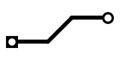

# raster - a convenience package to render vector graphics as images

## Overview

The raster package helps visualize vector graphics in the form of a
PNG image. It can be used with the
[`"golang.org/x/image/vector"`](https://pkg.go.dev/golang.org/x/image/vector)
package. Using primatives in that package, the `raster` package
provides support for rendering solid lines and approximate circles. It
also provides a convenience function to render the vector paths to an
image. Documentation for the `raster` package should be available on
[go.dev](https://pkg.go.dev/zappem.net/pub/graphics/raster).

The package provides a simple [`examples/trace.go`](examples/trace.go) program
that uses the package to render something resembling a PCB copper
trace.
```
$ go run examples/trace.go --dest image.png
```
creates the following `image.png` file:



## License info

The `raster` program is distributed with the same BSD 3-clause license
as that used by [golang](https://golang.org/LICENSE) itself.

## Reporting bugs and feature requests

The package `raster` has been developed purely out of curiosity for
and as part of a project to create simple PCBs using a Snapmaker 2 3D
printer (with laser and CNC tool heads). If you find a bug or want to
suggest a feature addition, please use the [bug
tracker](https://github.com/tinkerator/raster/issues).
